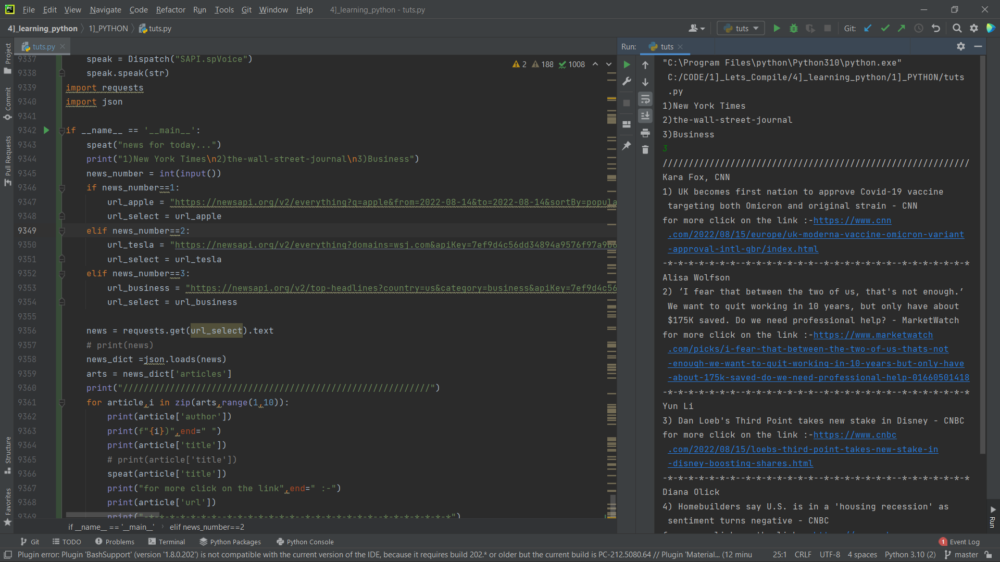

# tToogle_News

### Json - JavaScript Object Notition.
### Requests 
The requests module allows you to send HTTP requests using Python. The HTTP request returns a Response Object with all the response data (content, encoding, status, etc).
<br>
```
step1:
    I have used win32com module for voice speak.
    which converts text to speak
step2:
    learn json and request module
    json:- JavaScript Object Notation is a format for structuring data.
    It is mainly used for storing and transferring data between the browser and the server. 
    Python too supports JSON with a built-in package called json.
stem3:
    start working
```
## News Displaying📺 & Reading🔊 

If Want to read the complete News go to the link in output.